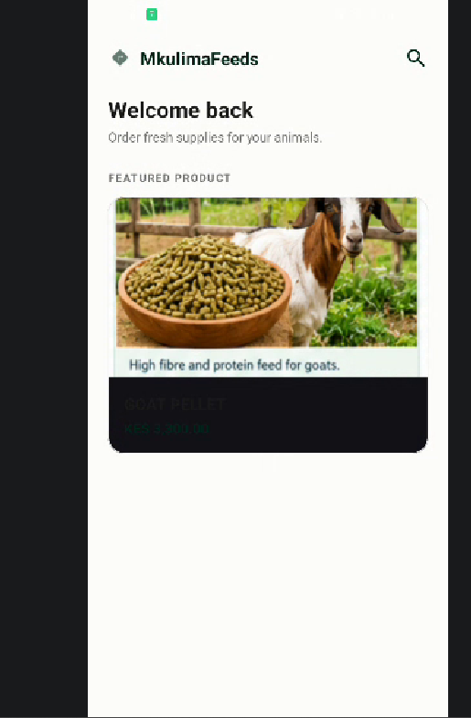
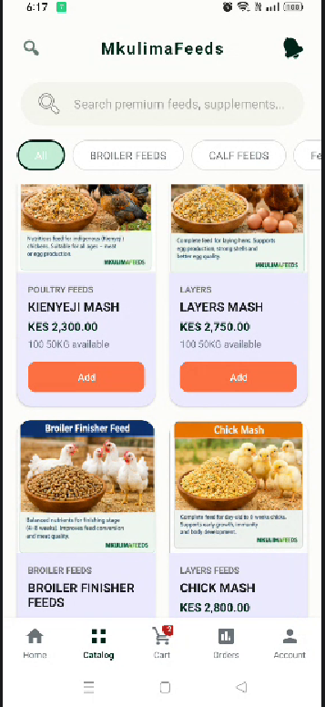

  MkulimaFeeds

A full-stack agricultural commerce platform connecting Kenyan farmers, dealers, and animal-feed suppliers.

[](https://kotlinlang.org/)
[](https://developer.android.com/)
[](https://ktor.io/)
[](https://www.postgresql.org/)
[](./LICENSE)
[](https://github.com/Movin-onyango/MkulimaFeeds/actions/workflows/ci.yml)


📖 Overview

MkulimaFeeds is a production-grade mobile platform that digitizes the animal-feed supply chain in Kenya. It serves **four distinct user roles** — Customer, Dealer, Staff, and Admin — each with a tailored experience covering the full business lifecycle: authentication, catalog browsing, cart & checkout, order fulfilment, dealer management, and administrative analytics.

 ## Why This Project Matters

- Real-world domain** — built around an actual Kenyan agri-business problem.
- Role-based architecture** — four user roles with granular RBAC on both client and server.
- Full-stack ownership** — native Android app + Ktor backend + PostgreSQL, designed and built end-to-end.
- Production concerns** — JWT auth, bcrypt hashing, OTP rate limiting, soft deletes, audit logging.

## Architecture
```
┌─────────────────────────┐         ┌──────────────────────────┐
│   Android App (Kotlin)  │  HTTPS  │   Ktor Backend (Kotlin)  
│   ViewModels + Flow    │ ──────►   - Routes → Services     
│   Ktor Client          │   JWT   │   - Exposed ORM           
│   Material 3           │ ◄──────   - RBAC Guard            
│   Role-based UI        │   JSON  │  • JWT Auth              
└─────────────────────────┘         └────────────┬─────────────┘
                                                 │
                                                 ▼
                                    ┌────────────────────────┐
                                    │      PostgreSQL        
                                    └────────────────────────┘
```
##  Key Features

### 👤 Customer
- Two-step registration with email/SMS OTP verification
- Product catalog with category filters and search
- Cart, checkout, saved delivery locations
- Visual order tracking timeline
- Profile management, password change, account deletion

###  Dealer
- Dashboard with KPIs and upcoming deliveries
- View & update assigned orders
- Manage assigned customers
- Performance reports (completion rate, earnings)

### 🛡️ Admin
- Real-time business intelligence dashboard
- Product CRUD with image uploads
- User management (promote, demote, suspend, reactivate)
- Dealer application review workflow
- Configurable business rules
- Role-change audit log

### ⚙️ Backend Highlights
- **RBAC engine** — central permission map with 25+ permissions
- **OTP system** — bcrypt-hashed codes, TTL, attempt limits, rate limiting
- **Order state machine** — validated status transitions
- **Inventory integrity** — automatic stock adjustment on confirm/cancel
- **Settings service** — runtime-editable business rules

## 🛠️ Tech Stack

 Layer | Technology |
 **Frontend** | Kotlin, Android SDK, Material 3, ViewModel, StateFlow, Ktor Client |
 **Backend** | Kotlin, Ktor, Exposed ORM, JWT (Auth0), Bcrypt |
 **Database** | PostgreSQL |
 **Integrations** | Resend (email), Africa's Talking (SMS) |
 **Tooling** | Gradle (Kotlin DSL), Logback, kotlinx.serialization |

## 📂 Project Structure

MkulimaFeeds/
├── android-app/     Android client (Kotlin, XML, Material 3)
├── backend/         Ktor server (Kotlin, Exposed, PostgreSQL)
├── docs/            Architecture, API reference, screenshots
└── README.md

## 🚀 Getting Started

### Prerequisites
- JDK 17+
- Android Studio (Hedgehog or newer)
- PostgreSQL 14+
- Gradle 8+

### 1. Backend Setup

bash
cd backend


Create `.env` (never committed) or export:

bash
export DB_HOST=localhost
export DB_PORT=5432
export DB_NAME=mkulimafeeds_db
export DB_USER=mkulimafeeds_app
export DB_PASSWORD=<Movo1648>
export JWT_SECRET=<>


Run:
bash
./gradlew run


API is live at `http://localhost:8080`.

### 2. Android App

bash
cd android-app


- Open in Android Studio
- Verify `ApiConfig.BASE_URL` (emulator: `http://10.0.2.2:8080/`, physical device: `adb reverse tcp:8080 tcp:8080`)
- Build & run

## 📸 Screenshots

 Customer Home | Product Catalog | Admin Console | Sales Insights |

  |  |  |  |

(Screenshots to be added — see `docs/screenshots/`.)

## 🔐 Security Practices

- JWT-based stateless authentication
- Bcrypt password hashing (cost factor 12)
- OTPs hashed before storage
- Per-destination rate limiting on OTP requests
- RBAC enforced server-side
- Soft deletes preserve referential integrity
- Secrets loaded from environment, never committed

## 🗺️ Roadmap

- [ ] Migrate in-memory pending auth storage to Redis
- [ ] Refactor frontend bottom-nav logic into a shared base
- [ ] Add CI/CD pipeline (GitHub Actions)
- [ ] Dockerize backend + Postgres
- [ ] Integration test suite

## 👤 Author

**Movin Onyango**
- GitHub: [@Movin-onyango](https://github.com/Movin-onyango)
- LinkedIn: www.linkedin.com/in/movin-odhiambo-749684273
- Email: movinoscar45@gmail.com

## 📄 License

MIT — see [LICENSE](./LICENSE).