  MkulimaFeeds

A full-stack agricultural commerce platform connecting Kenyan farmers, dealers, and animal-feed suppliers.

[](https://kotlinlang.org/)
[](https://developer.android.com/)
[](https://ktor.io/)
[](https://www.postgresql.org/)
[](./LICENSE)
[](https://github.com/Movin-onyango/MkulimaFeeds/actions/workflows/ci.yml)


📖 Overview

MkulimaFeeds is a production-grade mobile platform that digitizes the animal-feed supply chain in Kenya. It serves **four distinct user roles** — Customer, Dealer, Staff, and Admin — each with a tailored experience covering the full business lifecycle: authentication, catalog browsing, cart & checkout, order fulfilment, dealer management, and administrative analytics.

 ## Why This Project Matters

- **Real-world domain** — built around an actual Kenyan agri-business problem.
- **Role-based architecture** — four user roles with granular RBAC on both client and server.
- **Full-stack ownership** — native Android app + Ktor backend + PostgreSQL, designed and built end-to-end.
- **Production concerns** — JWT auth, bcrypt hashing, OTP rate limiting, soft deletes, audit logging.

## Architecture
```
┌─────────────────────────┐         ┌──────────────────────────┐
│   Android App (Kotlin)  │  HTTPS  │   Ktor Backend (Kotlin)  
│   ViewModels + Flow    │ ──────►   - Routes → Services     
│   Ktor Client          │   JWT   │   - Exposed ORM           
│   Material 3           │ ◄──────   - RBAC Guard            
│   Role-based UI        │   JSON  │  • JWT Auth              
└─────────────────────────┘         └────────────┬─────────────┘
                                                 │
                                                 ▼
                                    ┌────────────────────────┐
                                    │      PostgreSQL        
                                    └────────────────────────┘
```
##  Key Features

### 👤 Customer
- Two-step registration with email/SMS OTP verification
- Product catalog with category filters and search
- Cart, checkout, saved delivery locations
- Visual order tracking timeline
- Profile management, password change, account deletion

###  Dealer
- Dashboard with KPIs and upcoming deliveries
- View & update assigned orders
- Manage assigned customers
- Performance reports (completion rate, earnings)

### 🛡️ Admin
- Real-time business intelligence dashboard
- Product CRUD with image uploads
- User management (promote, demote, suspend, reactivate)
- Dealer application review workflow
- Configurable business rules
- Role-change audit log

### ⚙️ Backend Highlights
- **RBAC engine** — central permission map with 25+ permissions
- **OTP system** — bcrypt-hashed codes, TTL, attempt limits, rate limiting
- **Order state machine** — validated status transitions
- **Inventory integrity** — automatic stock adjustment on confirm/cancel
- **Settings service** — runtime-editable business rules

## 🛠️ Tech Stack

 Layer | Technology |
 **Frontend** | Kotlin, Android SDK, Material 3, ViewModel, StateFlow, Ktor Client |
 **Backend** | Kotlin, Ktor, Exposed ORM, JWT (Auth0), Bcrypt |
 **Database** | PostgreSQL |
 **Integrations** | Resend (email), Africa's Talking (SMS) |
 **Tooling** | Gradle (Kotlin DSL), Logback, kotlinx.serialization |

## 📂 Project Structure

MkulimaFeeds/
├── android-app/     Android client (Kotlin, XML, Material 3)
├── backend/         Ktor server (Kotlin, Exposed, PostgreSQL)
├── docs/            Architecture, API reference, screenshots
└── README.md

## 🚀 Getting Started

There are two ways to run the backend: **Docker** (recommended, zero-config) or **locally** (requires PostgreSQL + JDK 17). Choose whichever fits your setup.

### Prerequisites

| Tool | Docker Route | Local Route |
|---|---|---|
| **Docker Desktop** | ✅ Required | ❌ Not needed |
| **JDK 17+** | ❌ Not needed | ✅ Required |
| **PostgreSQL 14+** | ❌ Not needed (containerized) | ✅ Required |
| **Android Studio** | ✅ For running the mobile app | ✅ For running the mobile app |

---

### Option 1 — Run with Docker (Recommended)

If you have Docker Desktop installed:

```bash
git clone https://github.com/Movin-onyango/MkulimaFeeds.git
cd MkulimaFeeds

# 1. Copy the environment template
cp .env.example .env

# 2. Edit .env — set DB_PASSWORD and JWT_SECRET at minimum
#    Tip: generate a JWT_SECRET with: openssl rand -base64 48

# 3. Build and start
docker compose up --build

# 4. Verify
curl http://localhost:8080/api/health
```

The backend is now live at `http://localhost:8080`, and PostgreSQL is running on `localhost:5432`.

To stop:
```bash
docker compose down
```

To stop and wipe the database:
```bash
docker compose down -v
```

---

### Option 2 — Run Locally (Without Docker)

If you don't have Docker installed, or prefer to run things directly:

**Step 1: Set up PostgreSQL**

Install PostgreSQL 14+ locally, then create the database and user:

```sql
CREATE DATABASE mkulimafeeds_db;
CREATE USER mkulimafeeds_app WITH ENCRYPTED PASSWORD 'your-password';
GRANT ALL PRIVILEGES ON DATABASE mkulimafeeds_db TO mkulimafeeds_app;
```

**Step 2: Configure environment variables**

Export these in your shell (or create a `.env` file in `backend/`):

```bash
export DB_HOST=localhost
export DB_PORT=5432
export DB_NAME=mkulimafeeds_db
export DB_USER=mkulimafeeds_app
export DB_PASSWORD=your-password
export JWT_SECRET=$(openssl rand -base64 48)
```

**Step 3: Run the backend**

```bash
cd backend
./gradlew run
```

The API will start on `http://localhost:8080`. On first run, Exposed automatically creates all 10 tables.

**Step 4: (Optional) Send real OTPs**

By default, OTPs are logged to the console instead of being sent. To enable real delivery:

```bash
export RESEND_API_KEY=re_...          # https://resend.com (free tier)
export AT_API_KEY=atsk_...            # https://africastalking.com (sandbox)
export AT_USERNAME=sandbox
```

Without these, verification codes still work — they just appear in the backend console output instead of arriving via email/SMS.

---

### Running the Android App

```bash
cd android-app
```

- Open the folder in **Android Studio**
- The backend URL is configured in `app/build.gradle.kts` via `buildConfigField("String", "BASE_URL", ...)`
- For the **emulator**: the current default `http://10.0.2.2:8080/` reaches your host's `localhost`
- For a **physical device**: run `adb reverse tcp:8080 tcp:8080` and use `http://127.0.0.1:8080/`
- Build & Run

---

### Need Help?

- **Backend won't start?** Check that PostgreSQL is running and the credentials in `.env` match.
- **Android build fails?** Ensure you've synced Gradle after cloning (`./gradlew --refresh-dependencies` in `android-app/`).
- **OTPs not arriving?** They may be in the console. Check the backend logs.
- **Port already in use?** Change `BACKEND_PORT` in `.env` or `port` in `application.conf`.

### 1. Backend Setup

bash
cd backend


Create `.env` (never committed) or export:

bash
export DB_HOST=localhost
export DB_PORT=5432
export DB_NAME=mkulimafeeds_db
export DB_USER=mkulimafeeds_app
export DB_PASSWORD=<Movo1648>
export JWT_SECRET=<>


Run:
bash
./gradlew run


API is live at `http://localhost:8080`.

### 2. Android App

bash
cd android-app
### Running the Android App

The app connects to the backend at `http://10.0.2.2:8080/` by default — this is the special IP that Android's emulator uses to reach your host machine's `localhost`.

**Requirements:**
1. Backend running via `docker compose up` on the same machine
2. App running in an **Android emulator** (not a physical device)

**If using a physical device:**
1. Connect via USB
2. Run `adb reverse tcp:8080 tcp:8080`
3. The app will now reach your host's backend

**If using a deployed backend:**
Change `BASE_URL` in `app/build.gradle.kts` to your server's public URL.

## 📸 Screenshots

### 🛒 Customer Experience

| Home & Featured | Product Catalog | Shopping Cart | Checkout |
|---|---|---|---|
|  |  | 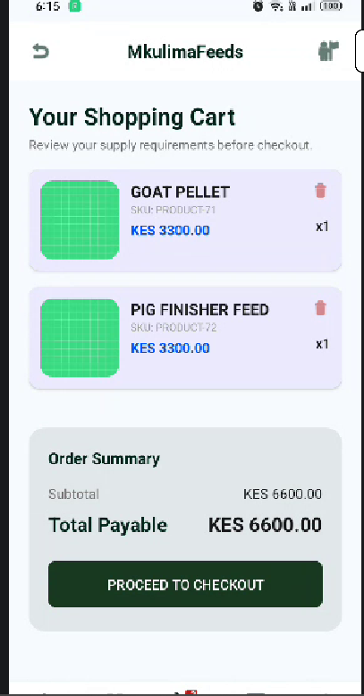 | 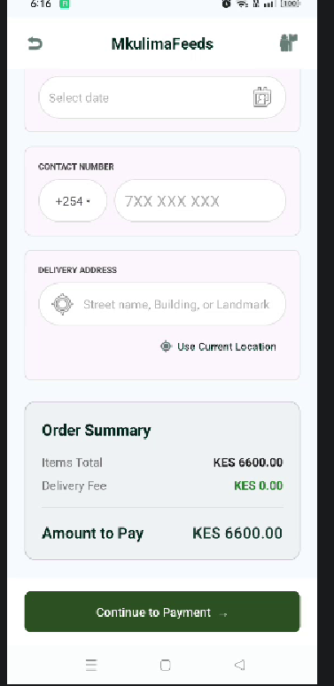 |

| My Orders | Customer Account | Saved Locations | Theme |
|---|---|---|---|
| 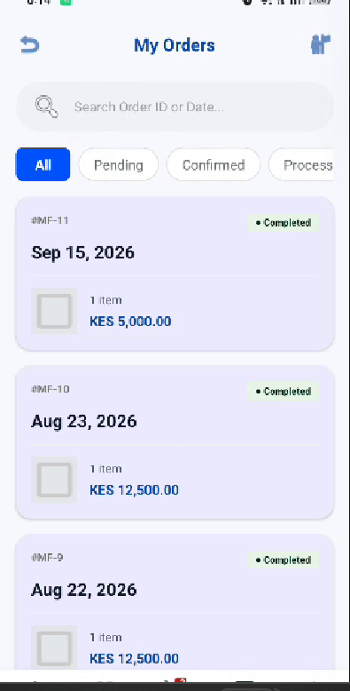 | 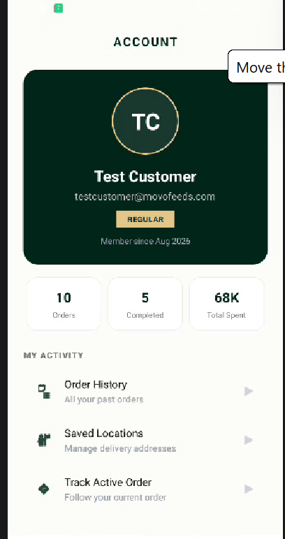 | 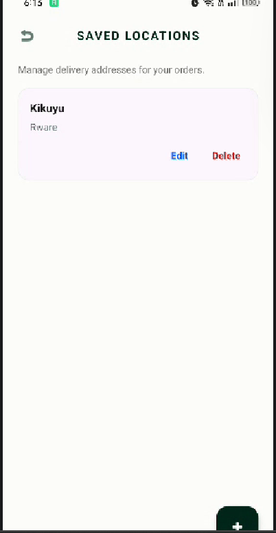 | 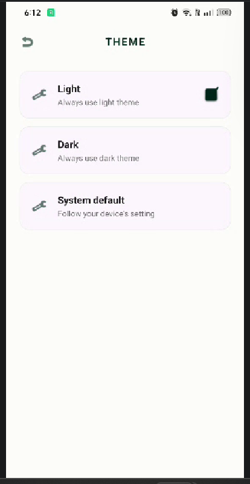 |

| Settings & Support | Saved Locations (Dark) |
|---|---|
| 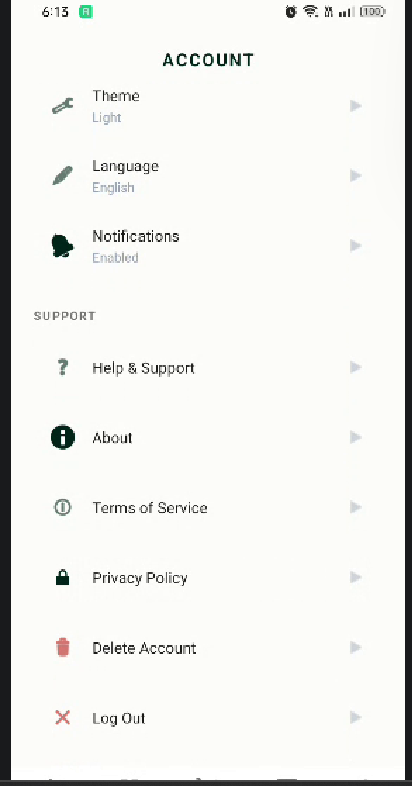 | 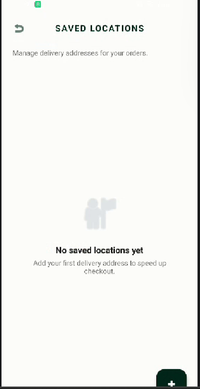 |

### 🛡️ Admin Console

| Admin Console | Product Management | Business Intelligence | Analytics Dashboard |
|---|---|---|---|
| 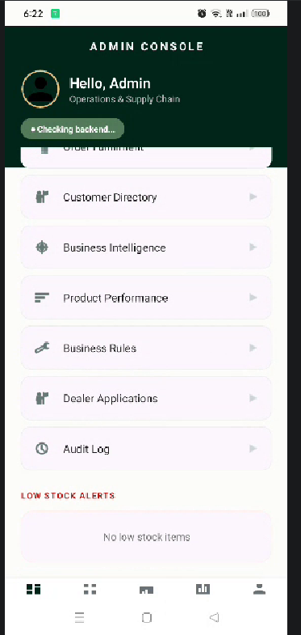 | 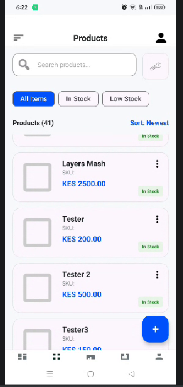 | 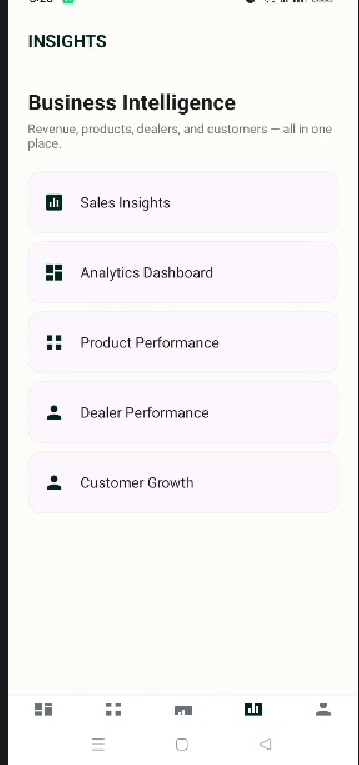 | 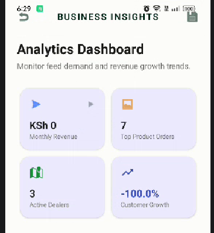 |

| BI Detail | Analytics Detail | Dealer Audit | Customer Directory |
|---|---|---|---|
| 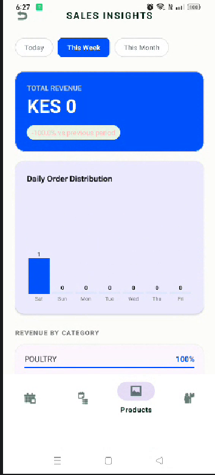 | 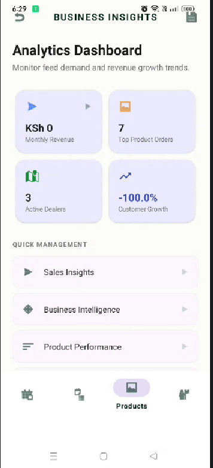 | 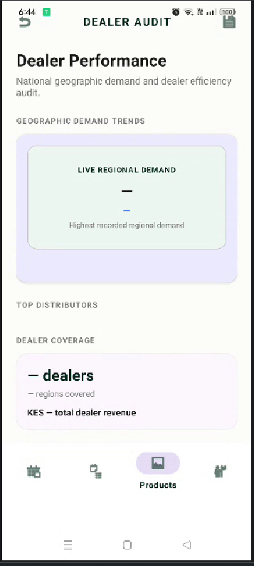 | 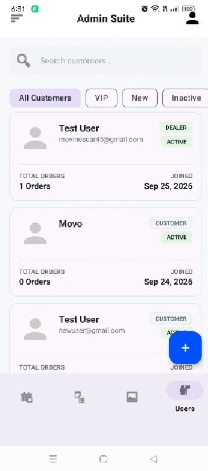 |

| Dealer Applications | Business Rules |
|---|---|
| 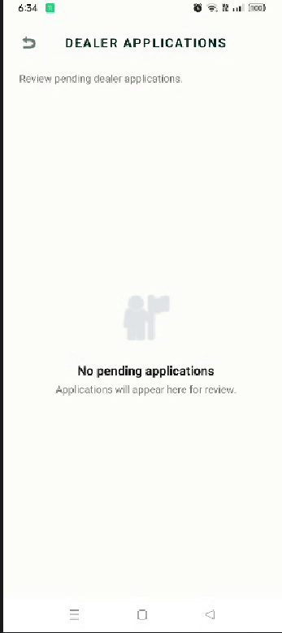 | 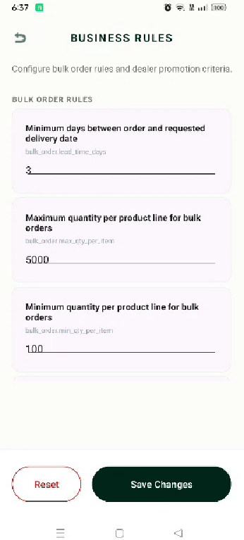 |

### 🚚 Dealer Experience

| Dealer Dashboard | Dealer Account | Dealer Orders | Dealer Catalog |
|---|---|---|---|
| 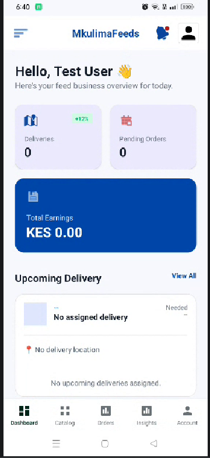 | 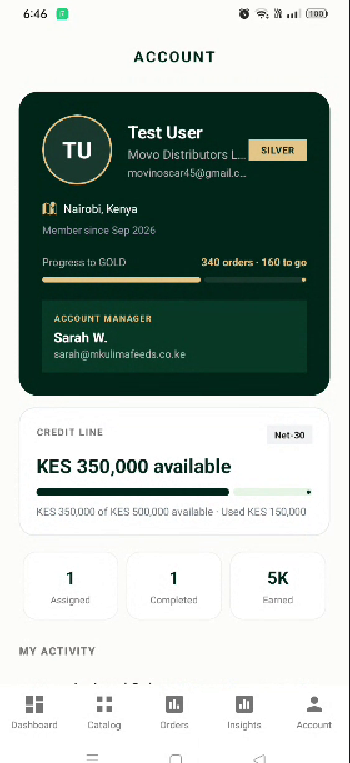 | 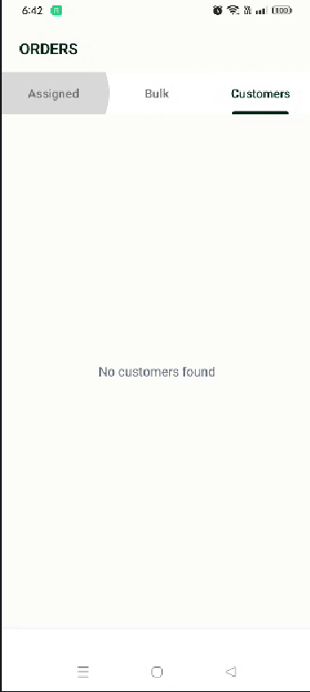 | 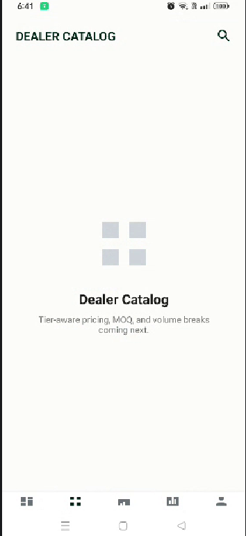 |

### 🔔 Notifications

| Notifications Inbox |
|---|
| 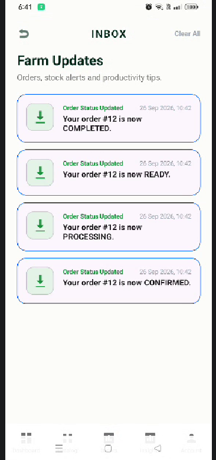 |
## 🔐 Security Practices

- JWT-based stateless authentication
- Bcrypt password hashing (cost factor 12)
- OTPs hashed before storage
- Per-destination rate limiting on OTP requests
- RBAC enforced server-side
- Soft deletes preserve referential integrity
- Secrets loaded from environment, never committed

## 🗺️ Roadmap

- [ ] Migrate in-memory pending auth storage to Redis
- [ ] Refactor frontend bottom-nav logic into a shared base
- [ ] Add CI/CD pipeline (GitHub Actions)
- [ ] Dockerize backend + Postgres
- [ ] Integration test suite

## 👤 Author

**Movin Onyango**
- GitHub: [@Movin-onyango](https://github.com/Movin-onyango)
- LinkedIn: www.linkedin.com/in/movin-odhiambo-749684273
- Email: movinoscar45@gmail.com

## 📚 Documentation

- [REST API Reference](docs/api.md)
- [Architecture Deep Dive](docs/architecture.md) 

## 📄 License

MIT — see [LICENSE](./LICENSE).